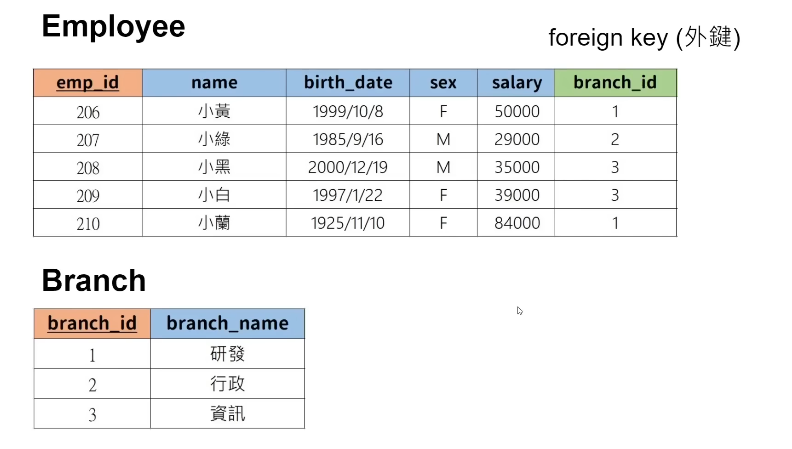
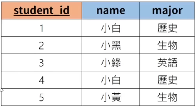
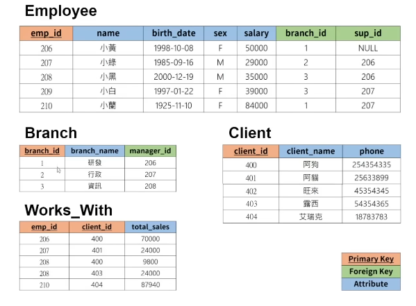

# 什么是资料库？

## 关联式资料库（SQL）

- MySQL
- Oracle
- PostgreSQl
- SQL Server

关联式资料库管理系统（EDBMS）

## 非关联式资料库（noSQL/not just SQL）

- MogoDB
- Redis
- DynamoDB
- Elaticsearch

非关联式资料库管理系统（NRDBMS）

## 什么是SQL？

Structure Query Language 结构性询问语言


# 表格和键 tables & keys

table：

| student_id | name | major |
| --- | --- | --- |
| 1 | 小黑 | 生物 |
| 2 | 小白 | 历史 |
| 3 | 小绿 | 英语 |
| 4 | 小白 | 历史 |

可以设定主键（primary key）可以唯一的表示每一笔资料，如student_id

连接到其他表格可以使用外键（foreign key）



主键可以设置多个，一点要可以指定唯一的资料

# 创建资料库 create database

创建一个名为sql_turotial 的资料库

一般名称会用 ` ` 包起来

```sql
CREATE DATABASE `sql_tutorial`;
```

展示资料库

```sql
SHOW DATABASE;
```

删除资料库

```sql
DROP DATABASE `sql_tutorial`
```

# 创建表格 create table

以sql_turotial为例

首先指定资料库

```sql
USE `sql_tutorial`;
```

资料库有资料形态：

| INT | 整数 |  |
| --- | --- | --- |
| DECIMAL(m,n) | 有小数点的数 | m表示总位数，n表示小数点后的位数 |
| VARCHAR(n) | 字符串 | n表示最多能存放的字元 |
| BLOB | 图片、影片、档案 | 二进制资料 |
| DATE | ‘YYYY-MM-DD’ 日期 |  |
| TIMESTAMP | ’YYYY-MM-DD   HH : MM : SS’ 记录时间 |  |

如要创建一下表格：



```sql
CREATE TABLE `student`(
		`student_id` INT PRIMARY KEY, //属性是int，顺便设定为主键
		`name` VARCHAR(20),
		`major` VARCHAR(20)           //最后一个不用写逗号
		//PEIMARY KEY(`student_id`)     也可以设定为主键
);
```

## 显示表格信息

```sql
DESCRIBE `student`;
```

## 删除表格

```sql
DROP TABLE `student`;
```

## 给表格增加一列gpa

```sql
ALTER TABLE `student` ADD gpa DECIMAL(3,2);
```

## 删掉某一行

```sql
ALTER TABLE `student` DROP COLUMN gpa;
```

# 存储资料 insert

创建完表格之后，根据属性存入资料

## 填入资料的顺序要根据创建时的顺序，即id→名称→学科

```sql
INSERT INTO `student` VALUES(1, "小白", "历史");
```

搜寻表格里的全部资料

```sql
SELECT * FROM `student`;  // * 是全部的意思
```

NULL 表示空

```sql
INSERT INTO `student` VALUES(2, "小黑", NULL);
```

## 或者写入时可以自己决定填入顺序

```sql
INSERT INTO `student`(`name`, `major`, `student_id`) VALUES("小黑", NULL, 2);
```

这个方法也可以只写其中一项或几项

# 限制，约束 constraints

```sql
CREATE TABLE `student`(
		`student_id` INT PRIMARY KEY, 
		`name` VARCHAR(20) NOT NULL,  //NOT NULL 表示这一项不能为空，输入NULL时报错
		`major` VARCHAR(20) UNIQUE    //UNIQUE：不可以重复      
);
```

```sql
`major` VARCHAR(20) DEFAULT `历史`;   //如果没有输入，默认是历史
```

```sql
`student_id` INT AUTO_INCREMENT,   //在新增一行是，不需要再输入这一项，默认是上一行加1
```

# 修改、删除资料 update & delete

## 修改

先把预设的更新模式关闭

```sql
SET SQL_SAFE_UPDATES = 0;
```

对于表格student：

```sql
CREATE TABLE `student`(
		`student_id` INT PRIMARY KEY, 
		`name` VARCHAR(20),
		`major` VARCHAR(20),
    `score` INT
);
```

预先存入第一行

```sql
INSERT INTO `student` VALUES(1,"小白", "英语", 60);
```

把英语改为英语文学

```sql
UPDATE `student`              //更新student里的资料
SET `major` = "英语文学"      //更新为英语文学
WHERE `major` = "英语";       //条件判断，major为英语的
```

条件可以改成两个：

```sql
UPDATE `student`              //更新student里的资料
SET `major` = "生化"      
WHERE `major` = "生物" OR `major` = "化学";       
```

或者改两个

```sql
UPDATE `student`              //更新student里的资料
SET `name` = "小灰"， `major` = "物理"   
WHERE `student_id` = 1;       //把id是1的人改为小灰，物理
```

如果没有写条件，所有都改掉。

## 删除

```sql
DELETE FROM `student`
WHERE `student_id` = 4;     //把id为4的资料删除
```

条件一样可以写多个

不写条件全部删除

<aside>
💡 注：不等于写作  ‘<>’

</aside>

# 取得资料 select

前面写过从student里面搜寻资料

```sql
SELECT * FROM `student`;
```

*表示取得所有的属性

可以改成其中的项

```sql
SELECT `name`,`major` FROM `student`;
```

只返回name和major

## 可以作排序

```sql
SELECT * FROM `student` ORDER BY `score`;
```

根据score作排序，由低到高

```sql
SELECT * FROM `student` ORDER BY `score` DESC;//DESC可以由高到底排序
```

## BY后面可以写多个属性

```sql
SELECT * FROM `student` ORDER BY `score`，`student_id`;//先排序score，如果score相同，再按id排序
```

## 限制资料数量

```sql
LIMIT 3；    //只返回前三个资料
```

## 同样可以用WHERE进行条件判断

```sql
SELECT * 
FROM `student`
WHERE `major` = "英语" OR `score` > 40;
```

# 创建公司资料库



## 创建员工表格

```sql
CREATE TABLE `employee`(
		`emp_id` INT PRIMARY KEY,
		`name` VARCHAR(20),
		`birth_date` DATE,
		`sex` VARCHAR(1),
		`salary` INT,
		`branch_id` INT,
		`sup_id` INT
);
```

## 创建部门表格

```sql
	CREATE TABLE `branch`(
		`branch_id` INT PRIMARY KEY,
		`branch_name` VARCHAR(20),
		`manager_id` INT,
		FOREIGN KEY (`manager_id`) REFERENCES `employee`(`emp_id`) ON DELETE SET NULL
		//把manager_id设定为employee里面的emp_id的foreign key。
		// ON DELETE SET NULL后面再解释
);
```

## 补上员工表格里的foreign key

```sql
ALTER TABLE `employee`
ADD FOREIGN KEY(`branch_id`)
REFERENCES `branch`(`branch_id`)
ON DELETE SET NULL;

ALTER TABLE `employee`
ADD FOREIGN KEY(`sup_id`)
REFERENCES `employee`(`sup_id`)
ON DELETE SET NULL;
```

## 创建客户表格

```sql
CREATE TABLE `client`(
		`client_id` INT PRIMARY KEY,
		`client_name` VARCHAR(20),
		`phone` VARCHAR(20)
);
```

## 创建work with 表格

```sql
CREATE TABLE `work_with`(
		`emp_id` INT,
		`client_id` INT,
		`total_sales` INT,
		PRIMARY KEY(`emp_id`,`client_id`),
		FOREIGN KEY (`emp_id`) REFERENCES `employee`(`emp_id`) ON DELETE CASCADE,
		FOREIGN KEY (`client_id`) REFERENCES `client`(`client_id`) ON DELETE CASCADE
);
```

## 新增资料

如果先加employee

```sql
INSERT INTO `employee` VALUES(206,"小黄","1998-10-08","F",50000,1,NULL);
```

直接写或报错，因为还没有branch_id：1

先设定branch，但是manager_id设定为NULL，然后设定employee，然后把manager_id加上

### 添加branch：

```sql
INSERT INTO `branch` VALUES(1,"研发",NULL);
INSERT INTO `branch` VALUES(2,"行政",NULL);
INSERT INTO `branch` VALUES(3,"咨询",NULL);
```

### 添加employee：

```sql
INSERT INTO `employee` VALUES(206,"小黄","1998-10-08","F",50000,1,NULL);
INSERT INTO `employee` VALUES(207,"小绿","1985-09-16","M",29000,2,206);
INSERT INTO `employee` VALUES(208,"小黑","2000-12-19","M",35000,3,206);
INSERT INTO `employee` VALUES(209,"小白","1997-01-22","F",39000,3,207);
INSERT INTO `employee` VALUES(210,"小兰","1995-11-10","F",84000,1,207);
```

### 加上manager_id:

```sql
UPDATE `branch`
SET `manager_id` = 206
WHERE `branch_id` = 1;

UPDATE `branch`
SET `manager_id` = 207
WHERE `branch_id` = 2;

UPDATE `branch`
SET `manager_id` = 208
WHERE `branch_id` = 3;
```

### 新增client资料

```sql
INSERT INTO `client` VALUES(400,"阿狗","234352364");
INSERT INTO `client` VALUES(401,"阿猫","574274626");
INSERT INTO `client` VALUES(402,"旺来","857835756");
INSERT INTO `client` VALUES(403,"露西","426573562");
INSERT INTO `client` VALUES(404,"艾瑞克","246586835");
```

### 新增work with

```sql
INSERT INTO `work_with` VALUES(206,400,70000);
INSERT INTO `work_with` VALUES(207,401,24000);
INSERT INTO `work_with` VALUES(208,402,9800);
INSERT INTO `work_with` VALUES(209,403,24000);
INSERT INTO `work_with` VALUES(210,404,87940);
```